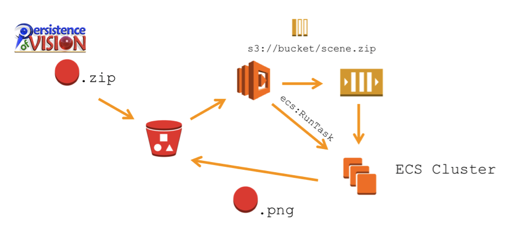

Copyright 2015 Amazon.com, Inc. or its affiliates. All Rights Reserved.

Licensed under the Apache License, Version 2.0 (the "License").
You may not use this file except in compliance with the License.
A copy of the License is located at

    http://aws.amazon.com/apache2.0/

or in the "license" file accompanying this file.
This file is distributed on an "AS IS" BASIS, WITHOUT WARRANTIES OR CONDITIONS OF ANY KIND, either express or implied.
See the License for the specific language governing permissions and limitations under the License.

# Lambda ECS Worker Pattern

This code example illustrates the concept of using Amazon ECS Tasks to extend the functionality of AWS Lambda.

In this pattern, an AWS Lambda function is triggered by an Amazon S3 event. The AWS Lambda function then pushes the
event data into an Amazon SQS queue and starts an Amazon ECS Task. A simple shell script running inside the Amazon ECS
Task’s container fetches the message from the Amazon SQS queue and processes it.

As a demo, we use this pattern to implement a ray-tracing worker using the popular open source
[POV-Ray](http://www.povray.org/) ray-tracer, triggered by uploading a POV-Ray scene description wrapped
into a .ZIP file in an Amazon S3 bucket. Running a ray-tracer inside AWS Lambda would probably take more than the
limit of 60 seconds to complete, so we use Lambda to push the Amazon S3 Notification data into an Amazon SQS queue and
start an Amazon ECS Task for the actual processing. The shell script running in the Amazon ECS Task’s container takes
care of fetching the input data from Amazon S3, running the POV-Ray ray-tracing software and uploading the result image
back into the Amazon S3 bucket.

## Files

The following files are included in this repository:

* README.txt: This file.
* LICENSE.txt: Apache 2.0 license under which this code is licensed.
* NOTICE.txt: Notice about the licensing of this code.
* ECSLogo: A directory containing the POV-Ray source for a demo image.
  * AWS_Logo_PoweredBy_300px.png: Official "Powered by AWS" logo image.
  * ECSLogo.ini: A POV-Ray .INI file containing rendering parameters.
  * ECSLogo.poc: A POV-Ray scene description file that renders the Amazon ECS Logo as a demo.
* ECSLogo.zip: The ZIPped contents of the ECSLogo directory.
* ecs-worker: A directory containing the worker shell script for the Amazon ECS Task.
  * ecs-worker.sh : The shell script to be run in a Docker Container as part of the Amazon ECS task.
* ecs-worker-launcher: A directory containing the AWS Lambda function.
  * ecs-worker-launcher.js: A Lambda function that sends event data into Amazon SQS and starts an Amazon ECS Task.
* fabfile.py: A Python Fabric script that configures all of the necessary components for this demo.
* config.py: User-specific constants for fabfile.py. Edit these with your own values.
* requirements.py: Python requirements file for fabfile.py.
* LambdaECSWorkerPattern.png: The image you see above.

## Prerequisites

* Pick an AWS Region that support AWS Lambda, Amazon ECS and Amazon SQS. Check the [AWS Region
  Table](https://aws.amazon.com/about-aws/global-infrastructure/regional-product-services/) to see a list of AWS
  services supported by AWS Region.
* You need the AWS CLI installed and configured. The [Setting Up section of the Amazon ECS
  documentation](http://docs.aws.amazon.com/AmazonECS/latest/developerguide/get-set-up-for-amazon-ecs.html) includes
  instructions on how to set up the AWS CLI.
* The AWS IAM user configured to use with the AWS CLI needs permissions that allow creating and configuring Amazon S3
  buckets, Amazon SQS queues, AWS Lambda functions, IAM Roles and policies, and Amazon ECS task definitions.
* You should be familiar with running AWS Lambda functions. Check out the [Getting Started 2: Handling Amazon S3 Events
  Using the AWS Lambda Console
  (Node.js)](http://docs.aws.amazon.com/lambda/latest/dg/getting-started-amazons3-events.html) guide to familiarize
  yourself with AWS Lambda and how to trigger Lambda functions from Amazon S3 event notifications.
* You should also understand the basic concepts behind Amazon EC2 Container Service (ECS). The [Getting Started with
  Amazon ECS](http://docs.aws.amazon.com/AmazonECS/latest/developerguide/ECS_GetStarted.html) guide is a good place to
  start. Use this guide to start a default Amazon ECS cluster, if you haven’t already.
* Some familiarity with Docker files, creating Docker images and using DockerHub would also be helpful. See the [Docker
  User Guide](https://docs.docker.com/userguide/) to get you acquainted with this.
* This demo uses DockerHub to manage and store Docker images. You can [set up a DockerHub account for
  free](https://hub.docker.com/) or modify the <code>fabfile.py</code> script to use a Docker repository of your own. 
  Keep your DockerHub or your own Docker repository’s credentials handy.
* We assume that the ECS cluster you’re using is this demo on is for testing and does not run critical applications.
  In particular, we’ll use one of the cluster nodes to build a docker image which may temporarily consume CPU and
  memory resources in addition to the containers you’re running on the cluster. This is for purposes of simplifying
  the demo and should not be done on production systems. Make sure you have enough spare RAM and CPU resources to
  prepare a new Docker image from scratch on its node(s). A simple "default" cluster with a single t2.micro instance
  set up as described in the ECS documentation is sufficient.

## How to setup

The fabfile.py Python script included in this repository comes with all commands necessary to set up and run this
sample application. You can examine the script to  identify individual steps, then run
<code>fab <name of function></code> individually, or you can simply run <code>fab setup</code> to get everything set
up for you.

Here’s how to set up:

    # 1. Clone this repository into a local directory.
    
    git clone https://github.com/awslabs/lambda-ecs-worker-pattern.git
    
    # 2. Edit config.py and use your own values there for your name and email address, DockerHub account details,
    #    AWS region, SSH key name and other details.
    
    # 3. Make sure you have Python2 installed. Depending on your installation,
    #    you may need to use the pip2 command below, or you can use the plain pip command if it points to the Python2
    #    version of PIP.
    
    sudo pip2 install -r requirements.txt
    
    # 4. Now, configure the AWS CLI if you haven’t already. This script will use your AWS credentials and other
    #    information from your AWS CLI configuration profile(s).
    
    fab setup
    
    #    At some stage, the script will ask you for your DockerHub login name and password, in order to upload a docker
    #    image to DockerHub and configure your ECS cluster to access your DockerHub private repository.
    
    # 5. Take a note of the bucket name mentioned at the end of the setup.
    
    # 6. Go to the AWS console, upload ECSLogo.zip to this bucket and wait a minute.

    # 7. Check the Lambda logs for any errors. If everything goes well, you should see a .PNG image in the same
    #    bucket a few minutes after uploading.
    
Enjoy!

